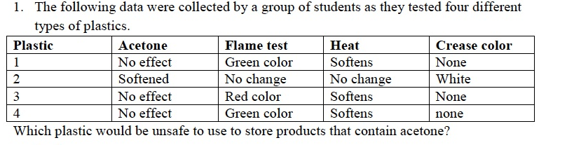
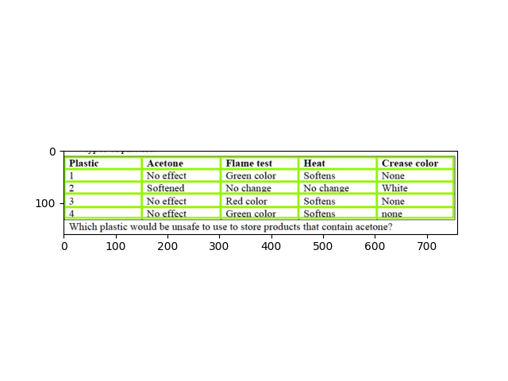
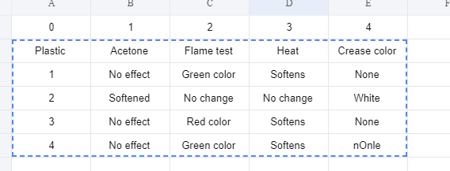

## Architecture

1. Table detection: Using SOTA detectron2
2. Table Line: Using architecture Unet + rule base
3. OCR: Using SOTA easyocr

## Train

### Prepare dataset:

Data is private not public, you can learn on internet about tabular data, You can label data by labelme ([wkentaro/labelme: Image Polygonal Annotation with Python (polygon, rectangle, circle, line, point and image-level flag annotation). (github.com)](https://github.com/wkentaro/labelme))

### Training

`Config params: file base_config.yaml`

```python
bash sh scripts/train.sh 
```

## Demo Table Line

```python
bash sh scripts/infer.sh 
```

`Step 1: Table detection`

`Step 2: Table Line`

`Input:`



`Output:`



## Table OCR

`Step 1: Table detection `

`Step 2: Table line`

`Step 3: Crop image according line`

`Step 4: OCR`

`Step 5: Save file csv/excel`

```
python table_ocr.py
```

`Input: ./datasets/demo_examples/demo2.png`


`Output: ./results/demo.csv`


